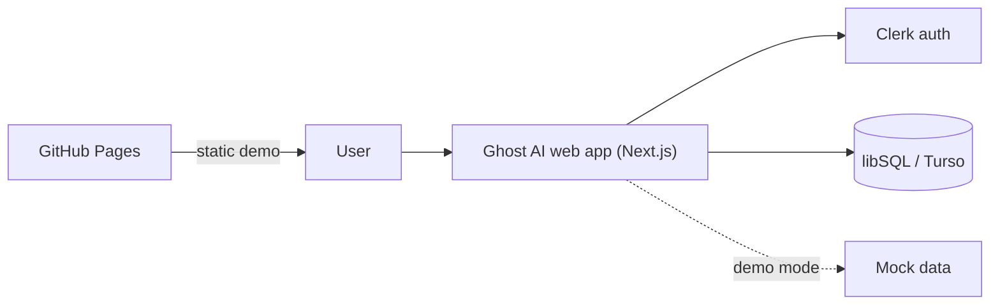
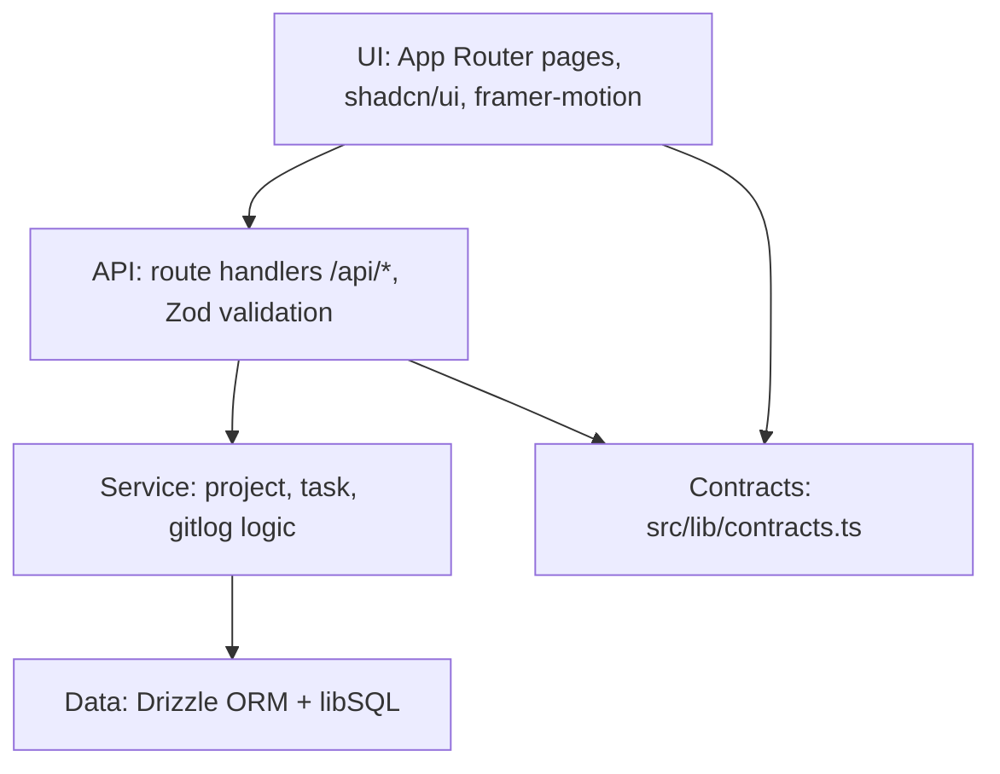
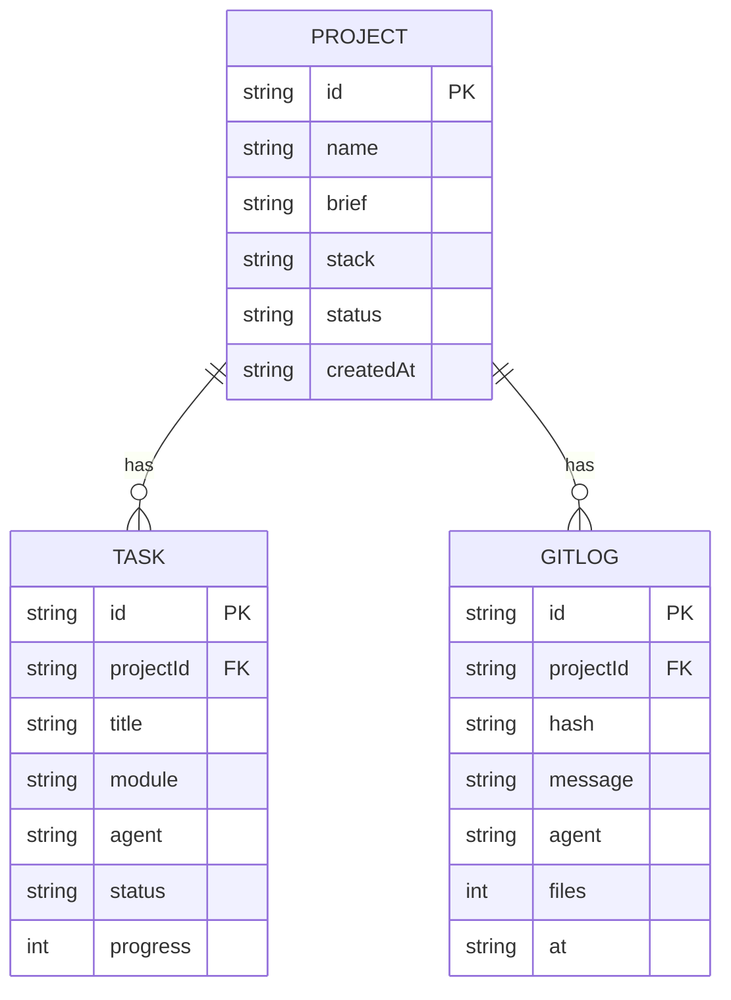
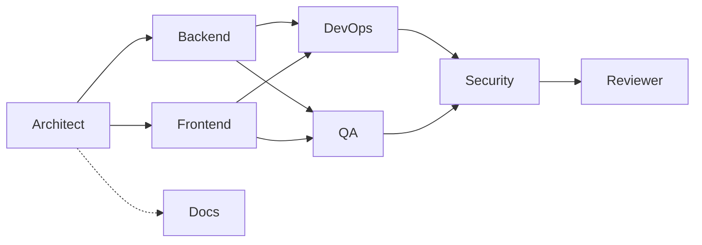

# Architecture

## System context

```mermaid
flowchart LR
  U[User] --> W["Ghost AI web app (Next.js)"]
  W --> C[Clerk auth]
  W --> D[(libSQL / Turso)]
  W -. demo mode .-> M[Mock data]
  GH[GitHub Pages] -->|static demo| U
```

## Layers

```mermaid
flowchart TB
  UI["UI: App Router pages, shadcn/ui, framer-motion"] --> API["API: route handlers /api/*, Zod validation"]
  API --> SVC["Service: project, task, gitlog logic"]
  SVC --> DB["Data: Drizzle ORM + libSQL"]
  UI --> CT["Contracts: src/lib/contracts.ts"]
  API --> CT
```

## Data model

```mermaid
erDiagram
  PROJECT ||--o{ TASK : has
  PROJECT ||--o{ GITLOG : has
  PROJECT {
    string id PK
    string name
    string brief
    string stack
    string status
    string createdAt
  }
  TASK {
    string id PK
    string projectId FK
    string title
    string module
    string agent
    string status
    int progress
  }
  GITLOG {
    string id PK
    string projectId FK
    string hash
    string message
    string agent
    int files
    string at
  }
```

## Agent pipeline

```mermaid
flowchart LR
  A[Architect] --> B[Backend]
  A --> F[Frontend]
  B --> O[DevOps]
  F --> O
  B --> Q[QA]
  F --> Q
  O --> S[Security]
  Q --> S
  S --> R[Reviewer]
  A -.-> Dc[Docs]
```
